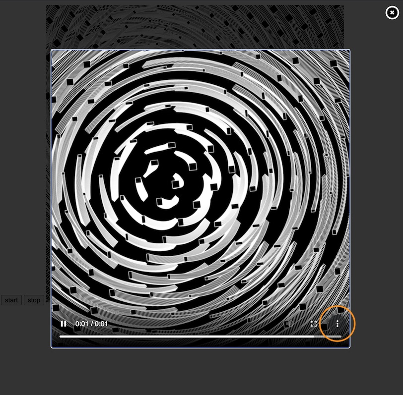

# p5.rec 🍿

Library for **easy recording of [p5.js](https://p5js.org) sketches** and **in-browser conversion to MP4**.

P5.rec hooks into the p5.js draw loop to produce buttery-smooth results 🧈🎉 to upload to Youtube, Instagram, Twitter, etc.

# Getting started

Import p5.rec from npm to your ```index.html```:
```html
  <head>
  ...
  <script type="module" src="unpkg.com/p5.rec@0.1.0/p5.rec.js"></script>
  ...
```

Launch with ```startRecording(options)``` (global mode):
```javascript
  startRecording();
```

and stop your recording with
```javascript
  stopRecording();
```

# API

**startRecording( options ):**
Starts the recording. Don't worry if the p5.js frame starts to look choppy, that's just so that p5.rec can do it's magic 🧙🏼‍♀️. *Options* is optional (just like each of its attributes) and gives you more control over the result:
```javascript
  startRecording({
    preset?: "slow",
      // H264 preset. One of [ "ultrafast",
      //                       "superfast",
      //                       "veryfast",
      //                       "faster",
      //                       "fast",
      //                       "medium",
      //                       "slow",
      //                       "slower",
      //                       "veryslow"]
      // See https://trac.ffmpeg.org/wiki/Encode/H.264
    crf: 18,
      // crf (Constant Rate Factor) defines video quality and
      // goes from 0 (maximum quality/size) to 51 (worst quality possible)
      // See https://trac.ffmpeg.org/wiki/Encode/H.264#crf
    onProgress: (p) => console.log(p),
      // callback for the encoding progress. *p* is a float from 0 to 1.
    onFinish: (videoBuffer) => {},
      // callback for the resulting Uint8array. By default, p5.rec shows an overlay for checking and downloading the result.
  });
```

# Notes

When starting transcoding, p5.rec has to download **@ffmpeg/core** (around 25MB) which takes a while.

Also, when no specific callback is provided for ```onFinish``` p5.rec opens an overlay with the result. In Chrome, you can use the 'Download' feature (bottom right) to download the result:



# Examples

Check out the examples from ```/examples``` for ways to use p5.rec locally.

# Alternatives
You might also want to use:
* [CCapture](https://github.com/spite/ccapture.js/) hooks into `requestAnimationFrame` to arrive at a similarly smooth result and let's you export webm and gif among others.
* [p5js-gif-recoder](https://github.com/datramt/p5js-gif-recorder) uses CCapture to export gifs directly from p5. 
* [p5.createLoop](https://github.com/mrchantey/p5.createLoop) creates loops and exports them as gifs from p5.

# Relies on
p5.rec is using [@ffmpeg/ffmpeg](https://www.npmjs.com/package/@ffmpeg/ffmpeg)